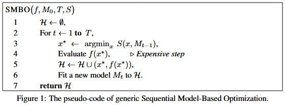

# Tree-structured Parzen Estimator Approach

本篇介绍黑盒优化的理论, 重点围绕 Tree-structured Parzen Estimator (TPE) 展开. 主要参考 NIPS 2011 的超参数优化论文: Algorithms for Hyper-Parameter Optimization [1]. 

## Sequential Model-based Global Optimization (SMBO)

序贯搜索方法 (**SMBO / 贝叶斯优化**) 是为**黑盒优化**场景设计的: 目标函数不可微、内部机制未知, 只能通过一次次试验拿到“输入→得分/损失”的反馈, 然后**边学边试**, 用代理模型指导下一次评估. SMBO 用来最优化期望改进 (Expected Improvement, EI), 目标是优化一个昂贵函数 $$f: X \rightarrow \mathbb{R}^N$$, ($$X$$ 为输入空间). 期望改进是选择下一个评估点 $$x$$ 的策略, 基于已知数据和模型, 选择能够最大化改进的点, 形式化为

$$
\mathbf{E I}_{y^*}(x):=\int_{-\infty}^{\infty} \max \left(y^*-y, 0\right) p_M(y \mid x) d y
$$

其中, $$y^*$$ 是分位数阈值 (比如取10%分位, 即数据集中 10% 的数据小于等于该分位数), $$y$$ 是 $$f$$ 在 $$x$$ 点处的取值, 由于 $$f$$ 函数是无解析式的黑盒, 所以采用模型 $$M$$ 来近似 $$P_M(y\mid x)$$, 即估计在给定 $$x$$ 条件下的 $$y = f(x)$$ 概率分布. $$max(y^* - y, 0)$$ 是计算潜在的改进, 如果阈值 $$y^*$$ 高于 $$y$$ 则取差值表示潜在的改进, 否则就是没有改进的可能, 则取 0. 

$$P_M(y\mid x)$$ 是模型 $$M$$ 预测的概率分布, 表示输入 $$x$$, $$f(x)$$ 取值为 $$y$$ 的概率. 

最终, 期望改进是对所有可能取值 $$y$$ 的改进的加权平均. 

SMBO 的伪代码如下:

其中, $$f$$ 即真实运行的函数, $$M_0$$ 是初始的代理模型(可以为空模型或者带先验的模型), $$T$$ 是外层循环次数(评估 $$f$$ 的次数), $$S$$ 是给定模型 $$M$$ 的采集函数, 即预测点 $$x$$ 的可优化标量, 用来挑选下一个评估点, 比如 EI (Expected Improvement) / PI (Probability of Improvement) / UCB (Upper Confidence Bound) 或 TPE 的 $$g(x)/\ell(x)$$.

$$\mathcal{H} = \{(x_i, f(x_i))\}$$ 是观测的历史数据, 初始化为空集. $$M_{t-1}$$ 用上一轮历史 $$\mathcal{H}$$ 拟合得到的当前代理模型, $$argmin_x$$ 取出在可行域 $$X$$ 内最小化采集函数的点 $$x$$ (如果是最大化问题, 则用 $$argmax_x$$), 这步属于内层数值优化, 通常可以采用随机搜索、多启动、CMA-ES、网格微调等方法. 

$$Evaluate\ f(x^*)$$ 即实际运行函数 $$f$$ 拿到真实的结果 $$y$$.  

Fit a new model $$M_t$$ to $$\mathcal{H}$$, 则是用新的历史重新拟合代理模型 $$M$$. 这一步, Gaussian Process Approach (GP) 是更新 $p(y\mid x)$, Tree-structured Parzen Estimator (TPE) 则是重建 $$g(x) / \ell(x)$$ 或密度估计.

最后返回 $$\mathcal{H}$$, 最优解可以取其中的 $$argmin\ f(x)$$ (最大化问题取 $$argmax\ f(x)$$).

## Tree-structured Parzen Estimator (TPE)

### Concepts

+ 分位数阈值 $$y^*$$: 选择 $$y^*$$ 为观察到的损失值(或者奖励值)的某个分位数, 如 $$\gamma$$ 分位数使 $$p(y < y^*) = \gamma$$. 这样 **TPE** 通过选择分位数来划分“好解集”和“坏解集”, 这样既保证了优化过程的多样性, 又避免了模型对最优值的过度集中. 
+ 好解集 $$\ell(x)$$: 指那些损失小于 $$y^*$$ 的点; 如果是最大化奖励目标, 则是大于 $$y^*$$ 的点
+ 坏解集 $$g(x)$$: 指那些损失大于或等于 $$y^*$$ 的点; 如果是最大化奖励目标, 则是小于或等于 $$y^*$$ 的点

### Comparison

+ 高斯过程 (GP): GP 方法通过直接建模目标函数 $$p(y\mid x)$$, 即在给定输入 $$x$$ 的条件下, 估计输出 $$y$$ 的分布. 这种方法在面对低维度数据时效果很好, 但当维度很高时, 它的计算开销和样本效率会变差. 

+ TPE (树结构 Parzen 估计): 相较于 GP, TPE 并不直接建模 $$p(y\mid x)$$ , 而是建模 $$p(x\mid y)$$ 和 $$p(y)$$. TPE 通过替代传统的配置空间分布 (prior distribution) , 采用非参数密度 (如高斯混合模型) 来建模目标函数的行为. 它将模型中的参数空间表示为树状结构, 而不是直接在空间内进行建模. 

### TPE Modeling

$$p(x\mid y)$$ 在给定损失 $$y$$ 的条件下, 预测配置 $$x$$ 的密度. 分为两部分 $$\ell(x)$$ 用于好解集, $$g(x)$$ 用于坏解集. 

$$
p(x \mid y)= \begin{cases}\ell(x) & \text { if } y<y^* \\ g(x) & \text { if } y \geq y^*\end{cases}
$$

通过在 $$\mathcal{H}$$ 中保存已观测变量的有序列表, TPE 算法每次迭代的运行时间可以与 $$|\mathcal{H}|$$ 成线性关系, 并与被优化的变量 (维度) 的数量成线性关系. 

TPE 的 EI 最优化公式推导

$$
\mathrm{EI}_{y^*}(x)=\int_{-\infty}^{y^*}\left(y^*-y\right) p(y \mid x) d y=\int_{-\infty}^{y^*}\left(y^*-y\right) \frac{p(x \mid y) p(y)}{p(x)} d y
$$

代入 $$\gamma=p\left(y<y^*\right) $$ 和 $$ p(x)=\int_{\mathbb{R}} p(x \mid y) p(y) d y=\gamma \ell(x)+(1-\gamma) g(x)$$ 得到

$$
\int_{-\infty}^{y^*}\left(y^*-y\right) p(x \mid y) p(y) d y=\ell(x) \int_{-\infty}^{y^*}\left(y^*-y\right) p(y) d y=\gamma y^* \ell(x)-\ell(x) \int_{-\infty}^{y^*} p(y) dy
$$

最后可以推出

$$
E I_{y^*}(x)=\frac{\gamma y^* \ell(x)-\ell(x) \int_{-\infty}^{y^*} p(y) d y}{\gamma \ell(x)+(1-\gamma) g(x)} \propto\left(\gamma+\frac{g(x)}{\ell(x)}(1-\gamma)\right)^{-1}
$$

所以, 为了最大化 $$E I_{y^*}(x)$$, 我们只需要最大化 $$\ell(x) / g(x)$$. 即选择那些在 $$\ell(x)$$ 下具有较高概率且在 $$g(x)$$ 下具有较低概率的点. $$\ell(x)$$ 和 $$g(x)$$ 的树结构形式使得根据 $$\ell(x)$$ 来生成许多候选点变得简单. 在每次迭代中, 算法返回具有最大期望改进 $$EI$$ 的候选点 $$x^*$$. 

## Reference

[1] James Bergstra, Rémi Bardenet, Yoshua Bengio, and Balázs Kégl. 2011. Algorithms for hyper-parameter optimization. In Proceedings of the 25th International Conference on Neural Information Processing Systems (NIPS'11). Curran Associates Inc., Red Hook, NY, USA, 2546–2554.

